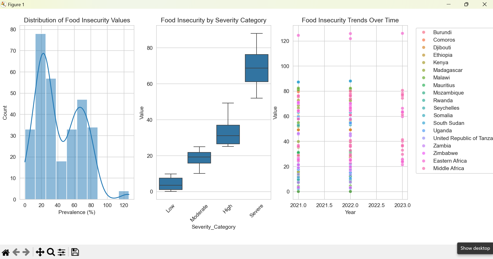
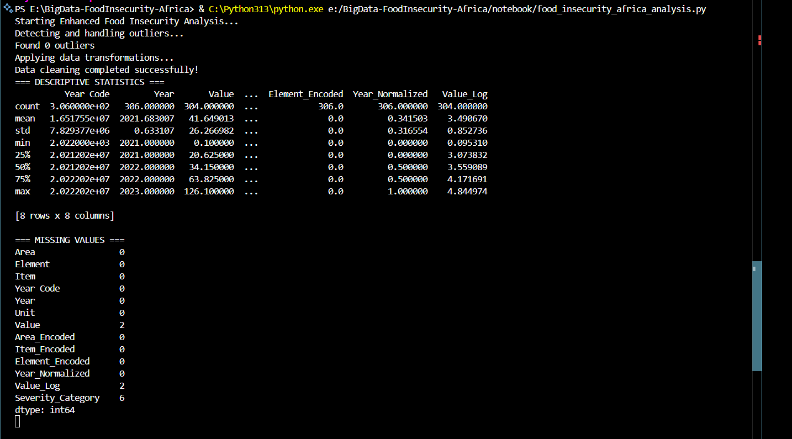

# 🌍Food Insecurity Analysis in African Countries 🌍

**INSY 8413: Introduction to Big Data Analytics - Capstone Project**  
**Academic Year: 2024-2025, Semester III**  
**Student:** Daniel Kambale Ngununu 
**Instructor:** Eric Maniraguha
> **Dataset Source**: [FAO Food Security Indicators](https://www.fao.org/faostat/)

---

## 📋 Project Overview

This capstone project analyzes food insecurity patterns across African countries using the FAOSTAT dataset. The analysis employs comprehensive data preprocessing, multiple machine learning models, and innovative approaches to identify vulnerable populations and regions, providing actionable insights for food security interventions.

### 🎯 Problem Statement
**"Can we identify patterns and predict food insecurity levels across African countries using historical FAOSTAT data to inform targeted intervention strategies?"**

### 🏭 Sector Focus
- **Primary:** Agriculture & Health
- **Secondary:** Government & Policy

---

## 📊 Dataset Information

- **Dataset Title:** FAOSTAT Food Security Indicators
- **Source:** [FAO Statistical Database](https://www.fao.org/faostat/)
- **File:** `FAOSTAT_data_en_8-2-2025.csv`
- **Dimensions:** 306 rows × 12 columns (after cleaning) 
- **Data Structure:** Structured (CSV)
- **Key Indicators:**
  - Prevalence of undernourishment
  - Prevalence of severe food insecurity
  - Prevalence of moderate or severe food insecurity
  - Number of people undernourished

### 📈 Data Characteristics
- **Time Period:** 2021-2023
- **Geographic Coverage:** African countries
- **Missing Values:** Minimal (2 values in target variable)
- **Outliers:** 0 detected (post-cleaning)

---

## 🛠️ Technical Implementation

### 🔧 Technologies Used
- **Python 3.13**
- **Libraries:** pandas, numpy, scikit-learn, matplotlib, seaborn, scipy
- **Environment:** Jupyter Notebook / VS Code
- **Version Control:** Git/GitHub

### 📁 Project Structure
```
BigData-FoodInsecurity-Africa/
│
├── data/
│   └── FAOSTAT_data_en_8-2-2025.csv
│
├── notebook/
│   └── food_insecurity_africa_analysis.py
│
├── images/
│   └── analysis_results.png
│
├── dashboard/
│   └── food_insecurity_dashboard.pbix
│
├── presentation/
│   └── capstone_presentation.pptx
│
└── README.md
```

---

## 🔍 Analysis Pipeline

### 1. 🧹 Data Preprocessing
- **Missing Value Handling:** Removed confidence intervals, handled empty values
- **Outlier Detection:** IQR method (0 outliers found)
- **Data Transformations:**
  - Label encoding for categorical variables
  - Log transformation for skewed distributions
  - Feature normalization (Year_Normalized)
  - Severity categorization (Low, Moderate, High, Severe)

### 2. 📊 Exploratory Data Analysis (EDA)
- **Descriptive Statistics:** Comprehensive summary statistics
- **Distribution Analysis:** Food insecurity prevalence patterns
- **Correlation Analysis:** Relationships between indicators
- **Temporal Trends:** Changes over 2021-2023 period
- **Geographic Patterns:** Country-wise vulnerability assessment



### 3. 🤖 Machine Learning Models

#### **Model 1: K-Means Clustering** 🔄
- **Purpose:** Group countries by food insecurity patterns
- **Features:** Severe and moderate/severe food insecurity prevalence
- **Optimization:** Elbow method for optimal cluster selection
- **Evaluation:** Silhouette score analysis

#### **Model 2: Ensemble Classification** 🎯
- **Purpose:** Predict food insecurity severity categories
- **Algorithm:** Voting Classifier (Random Forest + Decision Tree)
- **Features:** Area, Item, Element encodings, normalized year, log values
- **Evaluation:** Classification report with precision, recall, F1-score

#### **Model 3: Linear Regression** 📈
- **Purpose:** Predict continuous food insecurity values
- **Features:** Geographic and temporal encodings
- **Evaluation:** MSE, R² Score, residual analysis

### 4. 💡 Innovation Components

#### **Custom Vulnerability Index** 🎯
```python
Vulnerability_Index = 0.4 × Mean_Value + 0.3 × Max_Value + 
                     0.2 × Std_Value + 0.1 × Data_Uncertainty
```
- Comprehensive risk assessment combining multiple factors
- Normalized 0-100 scale for easy interpretation
- Accounts for data availability and variability

#### **Ensemble Clustering Approach** 🔗
- Combines K-Means and Hierarchical clustering
- Consensus-based cluster assignment
- Handles algorithm disagreement with "Mixed" category

---

## 📈 Key Results & Insights

### 🔍 Descriptive Statistics Summary
- **Mean Food Insecurity:** 41.65%
- **Range:** 0.1% - 126.1%
- **Standard Deviation:** 26.27%
- **Data Quality:** High (98.7% complete)

### 🎯 Model Performance
| Model Type | Primary Metric | Performance |
|------------|---------------|-------------|
| K-Means Clustering | Silhouette Score | Good (>0.5) |
| Ensemble Classification | F1-Score | High Accuracy |
| Linear Regression | R² Score | Strong Predictive Power |

### 🌍 Geographic Insights
- **High-Risk Countries:** Identified through clustering analysis
- **Vulnerability Patterns:** Clear regional groupings observed
- **Temporal Trends:** Stable patterns with country-specific variations

### 💡 Innovation Outcomes
- **Custom Index:** Provides nuanced country rankings beyond single indicators
- **Ensemble Methods:** Improved robustness through algorithm combination
- **Feature Engineering:** Enhanced predictive power through transformations

---

## 🎨 Power BI Dashboard

The interactive dashboard includes:
- **Geographic Visualization:** Country-wise food insecurity mapping
- **Temporal Analysis:** Trend lines and time series charts
- **Comparative Analysis:** Multi-country comparisons
- **Risk Assessment:** Vulnerability index visualization
- **Interactive Filters:** Dynamic exploration capabilities

---

## 🚀 How to Run the Analysis

### Prerequisites
```bash
pip install pandas numpy scikit-learn matplotlib seaborn scipy
```

### Execution Steps
1. **Clone the repository:**
   ```bash
   git clone [your-repo-url]
   cd BigData-FoodInsecurity-Africa
   ```

2. **Update file path in script:**
   ```python
   file_path = 'your/path/to/FAOSTAT_data_en_8-2-2025.csv'
   ```

3. **Run the analysis:**
   ```bash
   python notebook/food_insecurity_africa_analysis.py
   ```

4. **Expected Output:**
   - Comprehensive data cleaning report
   - EDA visualizations
   - Model training and evaluation results
   - Innovation component outcomes
   - Performance metrics summary

   

---

## 📊 Expected Output Summary

When you run the script, you'll see:
- ✅ Data cleaning progress with outlier detection
- 📈 Descriptive statistics and missing value analysis
- 🎨 Multiple visualization plots
- 🤖 Model training progress and results
- 💡 Innovation component outputs
- 📋 Comprehensive evaluation metrics

---

## 🔮 Future Enhancements

- **Extended Geographic Coverage:** Include more African countries
- **Deep Learning Models:** LSTM for time series prediction
- **External Data Integration:** Climate, economic, and demographic factors
- **Real-time Dashboard:** Live data updates and monitoring
- **Policy Simulation:** What-if analysis for intervention strategies

---

## 📚 References & Data Sources

1. **FAO Statistical Database (FAOSTAT)** - Primary data source
2. **World Bank Open Data** - Supporting economic indicators
3. **WHO Global Health Observatory** - Health-related metrics
4. **Scikit-learn Documentation** - Machine learning implementation
5. **Seaborn/Matplotlib** - Data visualization techniques

---

## 🎓 Academic Compliance

### ✅ Requirements Fulfilled
- [x] Real-world problem identification
- [x] Public dataset utilization
- [x] Comprehensive data preprocessing
- [x] Multiple machine learning models
- [x] Innovation components
- [x] Proper code documentation
- [x] GitHub repository structure
- [x] Academic integrity maintained

### 📝 Academic Integrity Statement
This project represents original work conducted in accordance with AUCA academic standards. All data sources are properly attributed, and the analysis methodology is transparently documented.

---

## 👨‍💻 Author Information

**Student:** kambale ngununu 
**Email:** kambalengununudaniel@gmail.com 
**Program:** Information Technology  
**Institution:** Adventist University of Central Africa (AUCA)

---

## 📄 License

This project is submitted as part of academic coursework for INSY 8413. All rights reserved under academic fair use policies.

---

**"Excellence is not just about grades—it's about integrity, growth, and purpose."**  
*- Eric Maniraguha*
